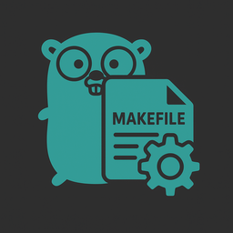

<!--
SPDX-FileCopyrightText: 2025 SAP SE or an SAP affiliate company
SPDX-License-Identifier: Apache-2.0
-->



# go-makefile-maker

[](https://github.com/sapcc/go-makefile-maker/actions/workflows/ci.yaml)

Generates a Makefile and optionally also GitHub workflows and a Dockerfile for your Go application:

* Makefile follows established Unix conventions for installing and packaging,
  and includes targets for vendoring, running tests and checking code quality.
* GitHub Workflows use [GitHub Actions](https://github.com/features/actions) to lint,
  build, and test your code. Additionally, you can enable workflows for checking your
  codebase for security issues (e.g. [CodeQL] code scanning), spelling errors, and missing
  license headers.

This project is based on the idea to have as many options as necessary but as little as possible.
Not every part of the program is configurable (see [#configuration](#configuration)), some things are hardcoded or implicit (see [#implicit-configuration](#implicit-configuration)).
If more options are required or some assumptions are wrong, please get in touch.

## Installation

The easiest way to get `go-makefile-maker` is: `go install github.com/sapcc/go-makefile-maker@latest`.

We also support the usual Makefile invocations: `make`, `make check`, and `make install`. The latter understands the conventional environment variables for choosing install locations: `DESTDIR` and `PREFIX`.

You usually want something like `make && sudo make install PREFIX=/usr/local`.

### MacOS

MacOS ships very old versions of awk, coreutils and findutils.
To make our lives easier, we use the GNU variants (e.g. `gsed` instead of `sed`) on Darwin.
Users are expected to provide these, e.g. via `brew install coreutils findutils gawk`.

## Usage

Put a `Makefile.maker.yaml` file in your Git repository's root directory, then run the following to generate Makefile and GitHub workflows:

```sh
$ go-makefile-maker
```

`go-makefile-maker` also generates a `help` target for usage info:

```sh
$ make help
```

In addition to the `Makefile.maker.yaml`, you should also commit the `Makefile` file so that your users don't need to have `go-makefile-maker` installed.

## Implicit Configuration

### Dependency licenses

The `check-dependency-licenses` make target and the `checks` github workflow use (go-licence-detector)[go-licence-detector] to check all dependencies to have compliant licenses.
See [license-scan-rules.json](./internal/makefile/license-scan-rules.json) for an incomplete list of licenses which is based on [SPDX licenses](https://spdx.org/licenses/) and [the internal risk analysis](https://wiki.one.int.sap/wiki/display/ospodocs/Licenses#Licenses-OpenSourceLicensesCategorization).
If the automatic license detection is not working, overrides can be specific in the [license-scan-overrides.jsonl](./internal/makefile/license-scan-overrides.jsonl) file.

## Configuration

`go-makefile-maker` requires a config file (`Makefile.maker.yaml`) in the [YAML format][yaml].

Take a look at `go-makefile-maker`'s [own config file](./Makefile.maker.yaml) for an example of what a config could like.

The config file has the following sections:

* [binaries](#binaries)
* [controllerGen](#controllergen)
* [coverageTest](#coveragetest)
* [dockerfile](#dockerfile)
* [golang](#golang)
* [golangciLint](#golangcilint)
* [goReleaser](#goreleaser)
* [makefile](#makefile)
* [metadata](#metadata)
* [nix](#nix)
* [renovate](#renovate)
* [reuse](#reuse)
* [shellCheck](#shellCheck)
* [spellCheck](#spellcheck)
* [testPackages](#testpackages)
* [variables](#variables)
* [verbatim](#verbatim)
* [githubWorkflow](#githubworkflow)
  * [githubWorkflow\.global](#githubworkflowglobal)
  * [githubWorkflow\.ci](#githubworkflowci)
  * [githubWorkflow\.pushContainerToGhcr](#githubworkflowpushcontainertoghcr)
  * [githubWorkflow\.release](#githubworkflowrelease)
  * [githubWorkflow\.securityChecks](#githubworkflowsecuritychecks)
  * [githubWorkflow\.license](#githubworkflowlicense)

### `binaries`

```yaml
binaries:
  - name: example
    fromPackage: ./cmd/example
    installTo: bin/
  - name: test-helper
    fromPackage: ./cmd/test-helper
```

For each binary specified here, a target will be generated that builds it with `go build` and puts it in `build/$NAME`.
The `fromPackage` is a Go module path relative to the directory containing the Makefile.

If `installTo` is set for at least one binary, the `install` target is added to the Makefile, and all binaries with `installTo` are installed by it.
In this case, `example` would be installed as `/usr/bin/example` by default, and `test-helper` would not be installed.

### `controllerGen`

```yaml
controllerGen:
  enabled: true
  crdOutputPath: config/crd/bases
  objectHeaderFile: boilerplate.go.txt
  rbacRoleName: manager-role
```

Customization options for controller-gen.

`enabled` defaults to the presence of the `sigs.k8s.io/controller-runtime` dependency unless set explicitly.

`crdOutputPath` allows changing the `output:crd:artifacts:config` argument given to `controller-gen rbac`. Defaults to `crd`.

`objectHeaderFile` allows changing the `headerFile` argument given to `controller-gen object`.

`rbacRoleName` allows changing the `roleName` argument given to controller-gen rbac. Defaults to the last element in the go module name.

### `coverageTest`

```yaml
coverageTest:
  only: '/internal'
  except: '/test/util|/test/mock'
```

When `make check` runs `go test`, it produces a test coverage report.
By default, all packages inside the repository are subject to coverage testing, but this section can be used to restrict this.

The values in `only` and `except` are regexes for `grep -E`.
Since only entire packages (not single source files) can be selected for coverage testing, the regexes have to match package names, not on file names.

### `dockerfile`

```yaml
dockerfile:
  enabled: true
  entrypoint: [ "/bin/bash", "--", "--arg" ]
  extraBuildStages:
    - |
      FROM ghcr.io/foobar/big-toolbox AS toolbox
      RUN toolbox-cmd
  extraBuildPackages:
    - linux-headers
  extraDirectives:
    - 'LABEL mylabel=myvalue'
    - 'COPY --from=toolbox /bin/fancytool /usr/bin/fancytool'
  extraIgnores:
    - tmp
    - files
  extraPackages:
    - curl
    - openssl
  runAsRoot: true
  useBuildKit: true
  withLinkerdAwait: true
```

When `enabled`, go-makefile-maker will generate a `Dockerfile` and a `.dockerignore` file.
The Dockerfile uses the [Golang base image](https://hub.docker.com/_/golang) to run `make install`, then copies all installed files into a fresh [Alpine base image](https://hub.docker.com/_/alpine).
The image is provisioned with a dedicated user account (name `appuser`, UID 4200, home directory `/home/appuser`) and user group (name `appgroup`, GID 4200) with stable names and IDs.
This user account is intended for use with all payloads that do not require a root user.

To ensure that the resulting Docker Image is functional, tests should be run before the image is built and uploaded.
As an additional smoke test, the compiled binaries are invoked with the `--version` argument after being copied to the final image.
With [go-api-declarations](https://github.com/sapcc/go-api-declarations)'s [`bininfo.HandleVersionArgument` function](https://pkg.go.dev/github.com/sapcc/go-api-declarations/bininfo#HandleVersionArgument), this can be implemented in one line. If you are using Cobra or any other library to handle arguments, the [`bininfo.Version` function](https://pkg.go.dev/github.com/sapcc/go-api-declarations/bininfo#Version) is recommended instead.

* `entrypoint` allows overwriting the final entrypoint.
* `extraBuildStages` prepends additional build stages at the top of the Dockerfile. This is useful for bringing in precompiled assets from other images, or if a non-Go compilation step is required.
* `extraBuildPackages` installs extra Alpine packages in the Docker layer where `make install` is executed. We always install `ca-certificates`, `gcc`, `git`, `make` and `musl-dev`.
* `extraDirectives` appends additional directives near the end of the Dockerfile.
* `extraIgnores` appends entries in `.dockerignore` to the default ones.
* `extraPackages` installs extra Alpine packages in the final Docker layer. `ca-certificates` is always installed.
* `runAsRoot` skips the privilege drop in the Dockerfile, i.e. the `USER appuser:appgroup` command is not added.
* `useBuildKit` enables the use of Docker BuildKit for building the image. This is recommended for better performance and caching but requires the feature to be enabled via the `DOCKER_BUILDKIT=1` environment variable or in the Docker daemon config file.
* `withLinkerdAwait` whether to download the binary and prepend linkerd-await to the entrypoint. For more details see <https://github.com/linkerd/linkerd-await>.

### `golang`

```yaml
golang:
  autoupdateableDeps: '^github.com/(?:sap-cloud-infrastructure|sapcc)/'
  enableVendoring: true
  ldflags: -X "main.goversion={{.Env.GOVERSION}}"
  setGoModVersion: true
```

Set `golang.enableVendoring` to `true` if you vendor all dependencies in your repository. With vendoring enabled:

1. The default for `GO_BUILDFLAGS` is set to `-mod vendor`, so that build targets default to using vendored dependencies.
  This means that building binaries does not require a network connection.
2. The `make tidy-deps` target is replaced by a `make vendor` target that runs `go mod tidy && go mod verify` just like `make tidy-deps`, but also runs `go mod vendor`.
  This target can be used to get the vendor directory up-to-date before commits.

If `golang.setGoModVersion` is set to `true`, then `go.mod` will be automatically updated to the latest version.

The `golang.ldflags` option can be used to share flags between the Makefile and GoReleaser.

If `golang.autoupdateableDeps` is filled with a [regular expression](https://pkg.go.dev/regexp/syntax), go-makefile-maker can be invoked with the `--autoupdate-deps` option to automatically upgrade all module dependencies matching that regex using `go get -u $MODULE@latest`.
This is intended for automated `go-makefile-maker` runs inside CI jobs that want to bundle some dependency updates together with the `go-makefile-maker` run in order to reduce the amount of automated chore commits in the commit history.

### `golangciLint`

```yaml
golangciLint:
  createConfig: true
  errcheckExcludes:
    - io/ioutil.ReadFile
    - io.Copy(*bytes.Buffer)
    - io.Copy(os.Stdout)
    - (*net/http.Client).Do
  skipDirs:
    - easypg/migrate/*
  timeout: 3m
```

The `make check` and `make static-check` targets use [`golangci-lint`](https://golangci-lint.run) to lint your code.

If `createConfig` is set to `true` then `go-makefile-maker` will create a
config file (`.golangci.yaml`) for `golangci-lint` and keep it up-to-date (in case of new changes).
This config file enables extra linters in addition to the default ones and configures various settings that can improve code quality.

Additionally, if `createConfig` is `true`, you can specify a list of files skipped entirely by golangci-lint in `skipDirs`
and a list of functions to be excluded from `errcheck` linter in `errcheckExcludes` field.
Refer to [`errcheck`'s README](https://github.com/kisielk/errcheck#excluding-functions) for info on the format
for function signatures that `errcheck` accepts.

`timeout` changes the `run.timeout` option. This should only be necessary to bump when in big projects like ones that use Kubernetes.

Take a look at `go-makefile-maker`'s own [`golangci-lint` config file](./.golangci.yaml) for an up-to-date example of what the generated config would look like.

### `goReleaser`

```yaml
goReleaser:
  enabled: true
  createConfig: true
  binaryName: "{{ .ProjectName }}_{{ .Os }}_{{ .Arch }}"
  format: .tar.gz
  nameTemplate: "{{ .ProjectName }}_{{ .Os }}_{{ .Arch }}"
```

If `goReleaser.createConfig` is set to true or it is unset but the release GitHub Workflow is enabled, a config file for goreleaser will be generated based on the metadata of the repository.

The `format` option can be used to only upload binaries. It corresponds to the upstream archives[].format option. See <https://goreleaser.com/customization/archive/> for more details.

The `binaryName` option can be used to change the name of the compiled binaries. It corresponds to the upstream builds[].binary option. This is only really useful when format is set to binary. It defaults to name of the first entry in the binaries option.

The `nameTemplate` option can be used to change the name of uploaded release artefacts. It corresponds to the upstream archives[].name_template option.

The `files` option can be used to add extra files. For backwards compatibility it defaults to `[ CHANGELOG.md, LICENSE, README.md ]`.

### `makefile`

```yaml
makefile:
  enabled: false
```

`makefile` contains settings related to the higher level `Makefile` generation.

`enabled` is an optional setting to disable the `Makefile` generation completely.
If not specified, the setting is treated as being set to true to maintain backwards compatibility with older configs.

### `metadata`

```yaml
metadata:
  url: https://github.com/foo/bar
```

`metadata` contains information about the project which cannot be guessed consistently:

- `url` is the repository's remote URL.

### `nix`

```yaml
nix:
  extraLibraries:
    - curl
  extraPackages:
    - mockgen
    - pkg-config
```

`extraLibraries` extra packages to add to buildInputs in the generated `shell.nix` file. This is useful for libraries like curl for go-curl.
`extraPackages` extra packages to add to nativeBuildInputs in the generated `shell.nix` file. This is useful if entries in `verbatim` require additional tools.

See <https://search.nixos.org/> for available packages and libraries.

### `renovate`

```yaml
renovate:
  enabled: true
  assignees:
    - devnull
    - urandom
  goVersion: 1.18
  packageRules:
    - matchPackageNames: []
      matchUpdateTypes: []
      matchDepTypes: []
      matchFileNames: []
      extends: []
      allowedVersions: ""
      minimumReleaseAge: ""
      autoMerge: false
      enabled: false
  customManagers: []
```

Generate [RenovateBot](https://renovatebot.com/) config to automatically create pull requests weekly on Fridays with dependency updates.

To assign people to the PRs created by renovate, add their GitHub handle to the `assignees` list.

Optionally overwrite go version with `goVersion`, by default the Go version from `go.mod` file will be used.

Additionally, you can also define [`packageRules`](https://docs.renovatebot.com/configuration-options/#packagerules). Note that only the fields mentioned above are accepted when defining a `packageRule`. The following package rules are defined by default:

```yaml
packageRules:
  # Group PRs for library dependencies together.
  - matchPackageNames: [ "!/^github\\.com\\/sapcc\\/.*/", "/.*/" ]
    groupName: "External dependencies"
    automerge: false
  - matchPackageNames: [ "/^github\\.com\\/sapcc\\/.*/" ]
    groupName: "github.com/sapcc"
    automerge: true

  # This package rule will be added if go.mod file has a `k8s.io/*` dependency.
  - matchPackagePrefixes: ["/^k8s.io\\//"]
    allowedVersions: 0.28.x

  # Restrict updates for versions managed by go-makefile-maker.
  - matchPackageNames: [ go, golang ]
    allowedVersions: $goVersion.x # only update within the same minor release
  - matchDepTypes: [ action ]
    enabled: false # see githubWorkflow config section below
  - matchDepTypes: [ dockerfile ]
    enabled: false # see docker config section above
```

You can also define [`customManagers`](https://docs.renovatebot.com/modules/manager/regex/). An example to detect `ENVTEST_K8S_VERSION` env variable version and update it in `Makefile`

```yaml
customManagers:
  - customType: "regex"
    description: "Bump envtest version in the Makefile"
    fileMatch: [
      "^Makefile$"
    ]
    matchStrings: [
      "ENVTEST_K8S_VERSION\\s*\\?=\\s*(?<currentValue>.?(?:\\d+\\.){0,2}\\d+)"
    ]
    datasourceTemplate: "github-tags"
    depNameTemplate: "kubernetes-sigs/controller-tools"
    extractVersionTemplate: "^envtest.v(?<version>.*)$"
```

### `reuse`

```yaml
reuse:
  enabled: false
  annotations:
    - paths:
        - internal/**/fixtures/*.json
      SPDX-FileCopyrightText: 'SAP SE or an SAP affiliate company'
      SPDX-License-Identifier: Apache-2.0
```

`reuse` contains settings related to the [REUSE](https://reuse.software/) config generation.

`enabled` is an optional setting to disable the REUSE config generation completely.
If not specified, the setting is treated as being set to true to maintain backwards compatibility with older configs.

By default, the generated `REUSE.toml` will cover license information for files generated by go-makefile-maker, as well as for vendored Go dependencies (if any).
The `make license-headers` target generated by go-makefile-maker will add license information to all other files that need it.
Additional `[[annotations]]` can be added to the `REUSE.toml` file through the `annotations` section, to avoid the need to clutter the repository with separate `.license` files (where file formats do not support license headers within the file).
If in doubt, always run `make license-headers` first, then only add entries to `reuse.annotations` to replace detached `.license` files.

### `shellCheck`

```yaml
shellCheck:
  enabled: true
  ignorePaths:
    - 'test/util/*'
    - 'test/mock/*'
  opts: '--shell=bash --external-sources -e SC1090,SC1091,SC2154'
```

Whether to run [`ShellCheck`](https://www.shellcheck.net/) on all shell scripts in the repository. It defaults to `true`.

`ignorePaths` specifies a list of path patterns to ignore. This accepts paths (eg. `test/util/*` or `./test/first.test`) and files (eg. `test_*.sh`).

`opts` specifies additional options to pass to `shellcheck`. The `-e` option can be used to ignore specific shellcheck warnings.

### `spellCheck`

```yaml
spellCheck:
  ignoreWords:
    - example
    - exampleTwo
```

`golangci-lint` (if `golangciLint.createConfig` is `true`) and the spell check GitHub workflow (`githubWorkflow.spellCheck`) use [`misspell`][misspell] to check for spelling errors.

If `spellCheck.ignoreWords` is defined then both `golangci-lint` and spell check workflow will give this word list to `misspell` so that they can be ignored during its checks.


### `testPackages`

```yaml
testPackages:
  only: '/internal'
  except: '/test/util|/test/mock'
```

By default, all packages inside the repository are subject to testing, but this section can be used to restrict this.

The values in `only` and `except` are regexes for `grep -E`.
Since only entire packages (not single source files) can be selected for testing, the regexes have to match package names, not on file names.

### `variables`

```yaml
variables:
  GO_BUILDENV: ''
  GO_BUILDFLAGS: '-mod vendor'
  GO_TESTFLAGS: ''
  GO_LDFLAGS: ''
  GO_TESTENV: ''
```

Allows to override the default values of Makefile variables used by the autogenerated recipes.
This mechanism cannot be used to define new variables to use in your own rules; use `verbatim` for that.
By default, all accepted variables are empty.
The only exception is that `GO_BUILDFLAGS` defaults to `-mod vendor` when vendoring is enabled (see below).

A typical usage of `GO_LDFLAGS` is to give compile-time values to the Go compiler with the `-X` linker flag:

```yaml
variables:
  GO_LDFLAGS: '-X github.com/foo/bar.Version = $(shell git describe --abbrev=7)'
```

However, for this specific usecase, we suggest that your application use `github.com/sapcc/go-api-declarations/bininfo`
instead. When the respective module is present as a direct dependency in the `go.mod` file, go-makefile-maker will
auto-generate suitable linker flags to fill the global variables in the `bininfo` package.

`GO_TESTFLAGS` can be used to provide additional flags to append to the test command flags:

```yaml
  GO_TESTFLAGS: '-count=1 -short'
```

`GO_TESTENV` can contain environment variables to pass to `go test`:

```yaml
variables:
  GO_TESTENV: 'POSTGRES_HOST=localhost POSTGRES_DATABASE=unittestdb'
```

`GO_BUILDENV` can contain environment variables to pass to `go build`:

```yaml
variables:
  GO_BUILDENV: 'CGO_CFLAGS=-D_LARGEFILE64_SOURCE'
```

### `verbatim`

```yaml
verbatim: |
  run-example: build/example
    ./build/example example-config.txt
```

This field can be used to add your own definitions and rules to the Makefile.
The text in this field is copied into the Makefile mostly verbatim, with one exception:
Since YAML does not like tabs for indentation, we allow rule recipes to be indented with spaces.
This indentation will be replaced with tabs before writing it into the actual Makefile.

### `githubWorkflow`

The `githubWorkflow` section holds configuration options that define the behavior of various GitHub workflows.

**Hint**: You can prevent the workflows from running by including `[ci skip]` in your commit message
([more info](https://github.blog/changelog/2021-02-08-github-actions-skip-pull-request-and-push-workflows-with-skip-ci/)).

#### `githubWorkflow.global`

This section defines global settings that apply to all workflows. If the same setting is
supported by a specific workflow and is defined then that will take override its global
value.

```yaml
global:
  defaultBranch: dev
  goVersion: 1.18
```

`defaultBranch` specifies the Git branch on which `push` actions will trigger the
workflows. This does not affect pull requests, they will automatically trigger all
workflows regardless of which branch they are working against. `go-makefile-maker` will
automatically run `git symbolic-ref refs/remotes/origin/HEAD | sed
's@^refs/remotes/origin/@@'` and use its value by default.

`goVersion` specifies the Go version that is used for jobs that require Go.
`go-makefile-maker` will automatically retrieve the Go version from `go.mod` file and use
that by default.

#### `githubWorkflow.ci`

This workflow:

* checks your code using `golangci-lint`
* ensures that your code compiles successfully
* runs tests and generates test coverage report
* uploads the test coverage report to [Coveralls]

```yaml
ci:
  enabled: true
  runOn:
    - macos-latest
    - ubuntu-latest
    - windows-latest
  coveralls: true
  prepareMakeTarget: generate
  ignorePaths: []
```

`runOn` specifies a list of machine(s) to run the `build` and `test` jobs on ([more info][ref-runs-on]).
You can use this to ensure that your build compilation and tests are
successful on multiple operating systems. Default value for this is `ubuntu-latest`.

If `coveralls` is `true` then your test coverage report will be uploaded to [Coveralls]. Make sure that you have enabled Coveralls for your GitHub repo beforehand.

`ignorePaths` specifies a list of filename patterns. Workflows will not trigger if a path
name matches a pattern in this list. [More info][ref-onpushpull] and [filter pattern cheat
sheet][ref-pattern-cheat-sheet]. This option is not defined by default.

`prepareMakeTarget` specifies an additional make target to run before running any ci checks.
This is useful when you need to run some additional commands before being able to run `go build` or `golangci-lint`.
For example when you are using `mockgen` or `go-bindata` through `verbatim`, you want to run the extra `verbatim` target through this option.

If your application depends on `github.com/lib/pq`, the latest PostgreSQL server binaries will be available in the container when tests are executed.
This is intended for use with `github.com/sapcc/go-bits/easypg`, which can launch a PostgreSQL server during `func TestMain`; see documentation in package easypg for details.

### `githubWorkflow.pushContainerToGhcr`

If `enabled` is set to true, the generated `Dockerfile` is built for the platforms `linux/amd64` and `linux/arm64` and pushed to the repository path under `ghcr.io`.

```yaml
pushContainerToGhcr:
  enabled: true
  platforms: "linux/amd64,linux/arm64"
  tagStrategy:
    - edge
    - latest
    - semver
    - sha
```

`platforms` configures for which platforms the multi-arch docker image is built. Defaults to `linux/amd64`. Note: emulation is provided by qemu and might take significant time.
`tagStrategy` influences which container tags will be pushed. Currently `edge`, `latest`, `semver` and `sha` are supported.

### `githubWorkflow.release`

If `release` is enabled a workflow is generated which creates a new GitHub release using goreleaser when a git tag is pushed.

`goReleaser.enabled` will be enabled automatically when the option isn't set yet.

#### `githubWorkflow.securityChecks`

If `securityChecks` is enabled then it will generate the following workflows:

* [CodeQL] workflow will run [CodeQL], GitHub's industry-leading semantic code analysis
  engine, on your source code to find security vulnerabilities. You can see the security
  report generated by CodeQL under your repo's Security tab.

  In addition to running the workflow when new code is pushed, this workflow will also run
  on a weekly basis (every Monday at 07:00 AM) so that existing code can be checked for
  new vulnerabilities.

* [dependency-review] workflow will scan your pull requests for dependency changes and
  will raise an error if any new dependencies have existing vulnerabilities.
  It uses the [GitHub Advisory Database](https://github.com/advisories) as a source.

* [govulncheck] workflow will scan your dependencies for vulnerabilities and
  will raise an error if any dependency has an existing vulnerability and the code path is in use.
  It uses the [Go Vulnerability Database](https://pkg.go.dev/vuln/) as a source.

```yaml
securityChecks:
  enabled: true
  queries: security-extended
```

`queries` is passed through to the GitHub Action. See the [GitHub Documentation](https://docs.github.com/en/code-security/code-scanning/creating-an-advanced-setup-for-code-scanning/customizing-your-advanced-setup-for-code-scanning#working-with-custom-configuration-files) for more information.

#### `githubWorkflow.license`

This workflow uses [`addlicense`][addlicense] to ensure that all your Go source code files have a license header.
If vendoring is enabled, the `vendor/` directory is always entirely ignored by this workflow.

```yaml
license:
  enabled: true
  ignorePatterns:
    - "vendor/**"
```

`ignorePatterns` specifies a list of file patterns to check. You can use any pattern
[supported by doublestar][doublestar-pattern]. See `addlicense`'s [README][addlicense] for more info.

**Hint**: You can also use `addlicense` to add license headers to all unignored Go files by running `make license-headers`. The copyright text used is customizable by setting `license.copyright` in the `Makefile.maker.yaml` file.

[codeql]: https://codeql.github.com/
[coveralls]: https://coveralls.io
[doublestar-pattern]: https://github.com/bmatcuk/doublestar#patterns
[go-licence-detector]: https://github.com/elastic/go-licence-detector
[govulncheck]: https://github.com/golang/vuln
[misspell]: https://github.com/client9/misspell
[ref-onpushpull]: https://docs.github.com/en/actions/reference/workflow-syntax-for-github-actions#onpushpull_requestpaths
[ref-pattern-cheat-sheet]: https://docs.github.com/en/actions/reference/workflow-syntax-for-github-actions#filter-pattern-cheat-sheet
[ref-runs-on]: https://docs.github.com/en/actions/reference/workflow-syntax-for-github-actions#jobsjob_idruns-on
[yaml]: https://yaml.org/
[addlicense]: https://github.com/google/addlicense
[dependency-review]: https://github.com/actions/dependency-review-action
